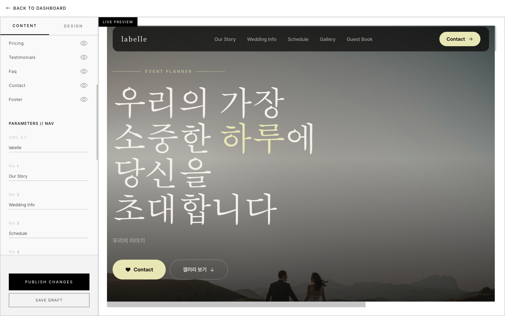
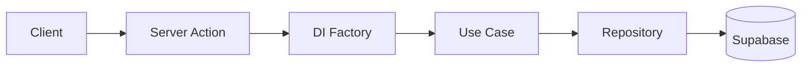

# Layer0 Studio

> 노코드 웹사이트 빌더 — 비개발자가 템플릿을 골라 시각적으로 편집하고 자신의 도메인으로 배포할 수 있는 SaaS 플랫폼.



- 🔗 **Live**: https://layer0-studio.vercel.app
- 📝 **포트폴리오 상세**: [docs/PORTFOLIO_ENTRY.md](docs/PORTFOLIO_ENTRY.md)
- 📖 **기술 글**: [Optimistic Concurrency Control 구현기](https://layer0-studio.vercel.app/articles/optimistic-concurrency.html)

**Stack**: Next.js 16 (App Router) · TypeScript · Supabase (Auth/DB/Storage) · Tailwind CSS v4 · Vercel

---

## Architecture

Clean Architecture — 의존성은 안쪽으로만 흐릅니다. Server Action이 요청마다 DI Factory에서 Use Case를 조립하고, Use Case는 Repository 인터페이스만 알며, Supabase 구현체는 Data 레이어에서 주입됩니다.



- **Domain layer** — 순수 비즈니스 로직(엔티티, 리포지토리 인터페이스, 유스케이스). Vitest 단위 테스트는 도메인 레이어만 in-memory fake로 검증합니다.
- **요청별 DI** — 싱글톤 없이 매 요청마다 새 Supabase 클라이언트로 조립. 인증 컨텍스트가 절대 누설되지 않습니다.
- **타입드 에러** — Use Case가 던지는 도메인 에러 코드를 클라이언트가 한국어 메시지로 매핑(`src/lib/errors/messages.ts`).

## Quick start

```bash
cp .env.local.example .env.local   # Supabase 자격 증명 채워넣기
pnpm install
pnpm dev                           # http://localhost:3000
```

### Required environment variables

```
NEXT_PUBLIC_SUPABASE_URL=
NEXT_PUBLIC_SUPABASE_ANON_KEY=
SUPABASE_SERVICE_ROLE_KEY=
NEXT_PUBLIC_SITE_URL=          # 예: https://layer0.studio — sitemap, robots, metadataBase, OG canonical
CRON_SECRET=                   # /api/cron/cleanup-assets Bearer 토큰
```

> `NEXT_PUBLIC_SITE_URL`이 비어 있으면 dev에서는 `http://localhost:3000`으로 폴백하지만, 프로덕션 빌드는 **하드 실패**합니다. Vercel에 먼저 등록하세요.

## Template system

템플릿은 `src/templates/<category>/<leaf>/` 안에 자기 토큰·라이브러리·렌더러를 모두 가진 자급식(self-contained) 구조입니다. **코드가 source of truth**이고 `pnpm template:sync`가 DB로 반영합니다 — 디렉터리만 추가하면 codegen이 자동으로 레지스트리에 등록.

자세한 내용은 [docs/TEMPLATE_SYSTEM.md](docs/TEMPLATE_SYSTEM.md).

## Editor reliability

- **Asset uploads — 2-phase commit**: `initUploadAction`이 `pending` DB 레코드를 만들고, 클라이언트가 Supabase Storage에 직접 업로드한 뒤 `confirmUploadAction`이 `active`로 마킹합니다. 고아 파일은 일일 크론(`/api/cron/cleanup-assets`)이 `sweep_orphaned_assets` RPC로 정리.
- **Optimistic concurrency**: 에디터 저장 시 행의 `expectedUpdatedAt`을 함께 보내고, `save_site_template_with_lock` RPC가 `STALE_VERSION`을 반환하면 충돌 모달로 안내합니다. 상세 구현은 [Optimistic Concurrency Control 구현기](https://layer0-studio.vercel.app/articles/optimistic-concurrency.html).

---

> 본 저장소는 **포트폴리오 공개용**이며 별도 라이선스를 부여하지 않습니다 (All Rights Reserved). 코드 열람은 자유롭게 가능하나, 복제·재배포·상업적 사용은 금지합니다.
