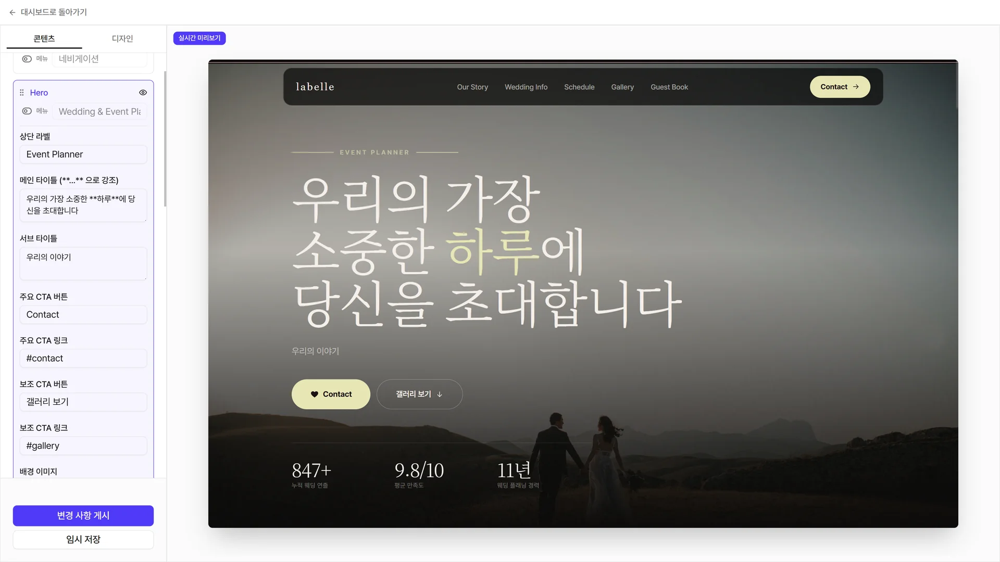
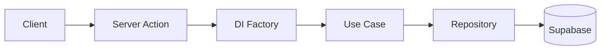

# Layer0 Studio

> 노코드 웹사이트 빌더 — 비개발자가 Template 을 골라 시각적으로 편집하고 공개 URL로 게시하는 SaaS 플랫폼.

| Template | Test | ADR | PR | Migration |
| --- | --- | --- | --- | --- |
| 11 | 301 | 15 | 79 | 25 |

- 🔗 **Live**: https://layer0-studio.vercel.app

**Stack**: Next.js 16 (App Router) · TypeScript · Supabase (Auth/DB/Storage) · Tailwind CSS v4 · i18n (ko/en) · Vercel



---

## 핵심 설계 개선

| 문제 | Before → After | 결정 |
|---|---|---|
| 편집 손실을 하나의 동시성 버그로 모델링하고 있었으나, 실제로는 **경로의 집합**이었음 — 화면 이탈 · 무한 디바운스 · 검증 함정문 · 탭 내 자기 충돌 | 미저장 손실 **무제한 → 최대 15초**<br>단독 편집 중 충돌 오류 **발생 → 제거** | [ADR-0015](docs/adr/0015-edit-loss-paths-exhaustive-defense.md) |
| DB · Storage · Auth 를 하나의 트랜잭션으로 삭제할 수 없어, 운영 환경에서 부분 파괴(계정만 남는 상태)가 발생 | 중간 실패 시 **부분 파괴 → 재개 후 완료**<br>삭제 대상 파일 경로를 Tombstone 으로 보존 | [ADR-0014](docs/adr/0014-account-erasure-tombstone-pipeline.md) |
| 랜딩 페이지가 Template 을 렌더링하지 않는데도 11개 Template 의 CSS 를 모두 로드 (인증 세션 조회 → DI → Template Registry 경로) | 초기 CSS **11 → 1개**<br>초기 폰트 **4.29 MiB → 233 KiB**<br>Lighthouse (Mobile) **55 → 90** | [ADR-0008](docs/adr/0008-keep-explicit-di-factories.md) |

각 개선의 원인 추적 과정 · 다이어그램 · 설계 메모는 **[docs/portfolio/layer0-studio.md](docs/portfolio/layer0-studio.md)**.

## Architecture

Clean Architecture — 의존성은 안쪽으로만 흐릅니다. Server Action이 요청마다 DI Factory에서 Use Case를 조립하고, Use Case는 Repository 인터페이스만 알며, Supabase 구현체는 Data 레이어에서 주입됩니다.



- **Domain layer** — 순수 비즈니스 로직(엔티티, 리포지토리 인터페이스, 유스케이스). Vitest 단위 테스트는 도메인 레이어만 in-memory fake로 검증합니다.
- **요청별 DI** — 싱글톤 없이 매 요청마다 새 Supabase 클라이언트로 조립. 인증 컨텍스트가 절대 누설되지 않습니다.
- **읽기 / 쓰기 경로 분리** ([ADR-0008](docs/adr/0008-keep-explicit-di-factories.md)) — 검증이 필요한 쓰기 경로만 Content Validator 와 Template Registry 를 끌어오고, 읽기 경로는 그 의존성을 아예 import 하지 않습니다. `pnpm performance:verify` 가 초기 스타일시트 수를 상한으로 고정해 Template 전용 CSS 의 재유입을 잡아냅니다 (실행 중인 서버가 필요해 CI 가 아니라 배포 전 로컬 검증 단계입니다).
- **타입드 에러** — Use Case가 던지는 도메인 에러 코드를 클라이언트가 한국어 메시지로 매핑(`src/lib/errors/messages.ts`).

## Template system

각 Template 은 `src/templates/<category>/<leaf>/` 안에 자기 토큰·라이브러리·렌더러를 모두 가진 자급식(self-contained) 구조 — Template 간 코드는 *전혀* 공유하지 않습니다 (DRY 보다 isolation 우선, [ADR-0001](docs/adr/0001-beta-model-template-isolation.md)). **코드가 source of truth**, `pnpm template:sync` 가 DB 로 반영 ([ADR-0002](docs/adr/0002-templates-source-of-truth-is-code.md)) — 디렉터리만 추가하면 codegen 이 자동으로 레지스트리에 등록.

Site 는 **Single**(한 스크롤, `sections[]`)과 **Multi**(라우팅되는 `pages[]` + 공유 header/footer) 두 Site Type 으로 나뉘며 생성 시 `mode` 로 고정됩니다 — 진화하지 않습니다 (`ContentModel` 구조적 유니온, [ADR-0007](docs/adr/0007-single-multi-site-type-structural-union.md)). 카탈로그는 여러 Category 에 걸쳐 있고 양쪽 Site Type 을 모두 출시 중입니다.

새 Template 은 Claude Code 의 `new-template` 스킬이 자연어 brief 로부터 자급식 디렉터리(토큰·라이브러리·프리셋·렌더러)를 만들고 verify 게이트까지 통과시키는 방식으로 저작합니다.

자세한 내용은 [docs/TEMPLATE_SYSTEM.md](docs/TEMPLATE_SYSTEM.md) · [docs/adr/](docs/adr/) · [CONTEXT.md](CONTEXT.md).

## Quick start

```bash
cp .env.local.example .env.local   # Supabase 자격 증명 채워넣기
pnpm install
pnpm dev                           # http://localhost:3000
```

### Required environment variables

```
NEXT_PUBLIC_SUPABASE_URL=
NEXT_PUBLIC_SUPABASE_ANON_KEY=
SUPABASE_SERVICE_ROLE_KEY=
NEXT_PUBLIC_SITE_URL=          # 예: https://layer0-studio.vercel.app — sitemap, robots, metadataBase, OG canonical
CRON_SECRET=                   # /api/cron/cleanup-assets Bearer 토큰
TEMPLATE_SYNC_SECRET=          # POST /api/admin/sync-templates Bearer 토큰 (Template 등록, ADR-0012)
```

> `NEXT_PUBLIC_SITE_URL`이 비어 있으면 dev에서는 `http://localhost:3000`으로 폴백하지만, 프로덕션 빌드는 **하드 실패**합니다. Vercel에 먼저 등록하세요.

---

> 본 저장소는 **포트폴리오 공개용**이며 별도 라이선스를 부여하지 않습니다 (All Rights Reserved). 코드 열람은 자유롭게 가능하나, 복제·재배포·상업적 사용은 금지합니다.
