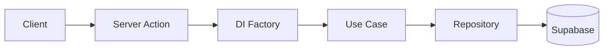

# Layer0 Studio

> 노코드 웹사이트 빌더 — 비개발자가 Template 을 골라 시각적으로 편집하고 공개 URL로 게시하는 SaaS 플랫폼.

- 🔗 **Live**: https://layer0-studio.vercel.app

**Stack**: Next.js 16 (App Router) · TypeScript · Supabase (Auth/DB/Storage) · Tailwind CSS v4 · i18n (ko/en) · Vercel

---

## 핵심 설계 개선

| 문제 | Before → After | 결정 |
|---|---|---|
| 게시가 `status` 플래그였고 공개 렌더러가 편집 중인 작업본을 직접 읽고 있었음 — 첫 게시 이후 모든 저장이 곧바로 공개 사이트에 반영 | 편집 중 내용의 **공개 노출 → 차단**<br>"변경 사항 게시"가 **무의미 → 실제 승격**<br>자동저장 인프라 **4개 모듈 → 0개** | [ADR-0017](docs/adr/0017-explicit-save-and-draft-published-split.md) |
| `SECURITY DEFINER` 함수 전부가 EXECUTE 권한을 회수한 적이 없어 PostgREST 로 직접 호출 가능 — RLS 는 우회됨 | 타 사용자 사이트 **덮어쓰기·삭제 가능 → 차단**<br>호출 롤 **PUBLIC → 함수별 1개 롤** | [마이그레이션 028](docs/migrations/028_harden_security_definer_rpcs.sql) |
| DB · Storage · Auth 를 하나의 트랜잭션으로 삭제할 수 없어, 운영 환경에서 부분 파괴(계정만 남는 상태)가 발생 | 중간 실패 시 **부분 파괴 → 재개 후 완료**<br>삭제 대상 파일 경로를 Tombstone 으로 보존 | [ADR-0014](docs/adr/0014-account-erasure-tombstone-pipeline.md) |
| 랜딩 페이지가 Template 을 렌더링하지 않는데도 11개 Template 의 CSS 를 모두 로드 (인증 세션 조회 → DI → Template Registry 경로) | 초기 stylesheet 요청 **13 → 1개**<br>Pretendard 요청 리소스 **2,061,242 → 232,628 bytes**<br>Lighthouse Mobile **72 → 97** | [ADR-0008](docs/adr/0008-keep-explicit-di-factories.md) · [검증 리포트](artifacts/lighthouse-2026-08-11/SUMMARY.md) |

> 성능 수치는 보존된 최적화 전·직후 프로덕션 배포를 Lighthouse 13.4.1 Mobile의 동일한 simulated throttling 조건으로 각각 3회 측정한 중앙값입니다. 범용 벤치마크나 실제 사용자 지표가 아닙니다.

## Architecture

Clean Architecture — 의존성은 안쪽으로만 흐릅니다. Server Action이 요청마다 DI Factory에서 Use Case를 조립하고, Use Case는 Repository 인터페이스만 알며, Supabase 구현체는 Data 레이어에서 주입됩니다.



- **Domain layer** — 순수 비즈니스 로직(엔티티, 리포지토리 인터페이스, 유스케이스). Vitest 단위 테스트는 도메인 레이어만 in-memory fake로 검증합니다.
- **요청별 DI** — 싱글톤 없이 매 요청마다 새 Supabase 클라이언트로 조립. 인증 컨텍스트가 절대 누설되지 않습니다.
- **읽기 / 쓰기 경로 분리** ([ADR-0008](docs/adr/0008-keep-explicit-di-factories.md)) — 검증이 필요한 쓰기 경로만 Content Validator 와 Template Registry 를 끌어오고, 읽기 경로는 그 의존성을 아예 import 하지 않습니다. `pnpm performance:verify` 가 초기 스타일시트 수를 상한으로 고정해 Template 전용 CSS 의 재유입을 잡아냅니다 (실행 중인 서버가 필요해 CI 가 아니라 배포 전 로컬 검증 단계입니다).
- **타입드 에러** — Use Case가 던지는 도메인 에러 코드를 클라이언트가 활성 locale(ko/en)의 표시 문자열로 매핑(`src/lib/errors/messages.ts`).

## Template system

각 Template 은 `src/templates/<category>/<leaf>/` 안에 자기 토큰·라이브러리·렌더러를 모두 가진 자급식(self-contained) 구조 — Template 간 코드는 *전혀* 공유하지 않습니다 (DRY 보다 isolation 우선, [ADR-0001](docs/adr/0001-beta-model-template-isolation.md)). **코드가 source of truth**, `pnpm template:sync` 가 DB 로 반영 ([ADR-0002](docs/adr/0002-templates-source-of-truth-is-code.md)) — 디렉터리만 추가하면 codegen 이 자동으로 레지스트리에 등록.

Site 는 **Single**(한 스크롤, `blocks[]`)과 **Multi**(라우팅되는 `pages[]` + 모든 Page 를 감싸는 `chrome`) 두 Site Type 으로 나뉘며 생성 시 `mode` 로 고정됩니다 — 진화하지 않습니다 (`ContentModel` 구조적 유니온, [ADR-0007](docs/adr/0007-single-multi-site-type-structural-union.md)). Block component 의 `fieldsSchema` 가 입력 구조의 진실이고, Site 의 Block 은 사용자 입력 **Value** 만 저장합니다 ([ADR-0016](docs/adr/0016-block-rename-and-field-value-split.md)).

Editor 는 콘텐츠·내비게이션·디자인을 분리해 편집합니다. Multi Site 는 콘텐츠 탭에서 Page 를 전환하고 해당 Page 의 Block 만 다루며, 내비게이션 탭에서 Page 순서·이름·노출 위치를 관리합니다. 미리보기의 Block 을 누르면 대응하는 편집 폼으로 이동하고, 콘텐츠 재렌더 중에도 같은 Page 의 미리보기 스크롤을 보존합니다.

**저장은 명시적입니다** — 자동저장은 없습니다. "임시 저장"은 사용자만 볼 수 있는 작업본을 갱신하고, "변경 사항 게시"가 그 작업본을 공개본으로 복사합니다. 방문자는 공개본만 봅니다. 저장 성공 표시는 화면에 보이는 편집까지 서버가 확인했을 때만 뜨고, 앱 안에서 편집기를 벗어나면 미저장 변경을 확인합니다. 탭 종료·브라우저 뒤로가기·크래시는 의도적으로 보장 범위 밖입니다 ([ADR-0017](docs/adr/0017-explicit-save-and-draft-published-split.md)).

게시된 Site 의 정식 주소는 `/site/<slug>`입니다. 서브도메인 서빙은 제품 요구와 운영 조건이 구체화될 때 새로 검토하며, 현재 로드맵에서는 무기한 보류합니다 ([ADR-0009](docs/adr/0009-subdomain-public-serving.md)).

새 Template 은 Claude Code 의 `new-template` 스킬이 자연어 brief 로부터 자급식 디렉터리(토큰·라이브러리·프리셋·렌더러)를 만들고 verify 게이트까지 통과시키는 방식으로 저작합니다.

현재 용어는 [CONTEXT.md](CONTEXT.md), Template 저작·운영 절차는 [docs/TEMPLATE_SYSTEM.md](docs/TEMPLATE_SYSTEM.md), 결정의 이유와 역사는 [docs/adr/](docs/adr/)가 정본입니다.

## Quick start

```bash
cp .env.local.example .env.local   # Supabase 자격 증명 채워넣기
pnpm install
pnpm dev                           # http://localhost:3000
```

### Required environment variables

```
NEXT_PUBLIC_SUPABASE_URL=
NEXT_PUBLIC_SUPABASE_ANON_KEY=
SUPABASE_SERVICE_ROLE_KEY=
NEXT_PUBLIC_SITE_URL=          # 예: https://layer0-studio.vercel.app — sitemap, robots, metadataBase, OG canonical
CRON_SECRET=                   # /api/cron/cleanup-assets Bearer 토큰
TEMPLATE_SYNC_SECRET=          # POST /api/admin/sync-templates Bearer 토큰 (Template 등록, ADR-0012)
```

> `NEXT_PUBLIC_SITE_URL`이 비어 있으면 dev에서는 `http://localhost:3000`으로 폴백하지만, 프로덕션 빌드는 **하드 실패**합니다. Vercel에 먼저 등록하세요.

---

> 본 저장소는 **포트폴리오 공개용**이며 별도 라이선스를 부여하지 않습니다 (All Rights Reserved). 코드 열람은 자유롭게 가능하나, 복제·재배포·상업적 사용은 금지합니다.
