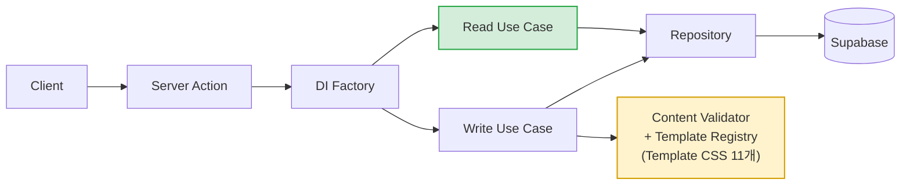

# Layer0 Studio

> 노코드 웹사이트 빌더 — 비개발자가 Template 을 골라 시각적으로 편집하고 자신의 Subdomain 으로 배포할 수 있는 SaaS 플랫폼.


- 🔗 **Live**: https://layer0-studio.vercel.app

**Stack**: Next.js 16 (App Router) · TypeScript · Supabase (Auth/DB/Storage) · Tailwind CSS v4 · Vercel

---

## Architecture

Clean Architecture — 의존성은 안쪽으로만 흐릅니다. Server Action이 요청마다 DI Factory에서 Use Case를 조립하고, Use Case는 Repository 인터페이스만 알며, Supabase 구현체는 Data 레이어에서 주입됩니다.



- **Domain layer** — 순수 비즈니스 로직(엔티티, 리포지토리 인터페이스, 유스케이스). Vitest 단위 테스트는 도메인 레이어만 in-memory fake로 검증합니다.
- **요청별 DI** — 싱글톤 없이 매 요청마다 새 Supabase 클라이언트로 조립. 인증 컨텍스트가 절대 누설되지 않습니다.
- **읽기 / 쓰기 경로 분리** ([ADR-0008](docs/adr/0008-keep-explicit-di-factories.md)) — DI Factory 를 범용 resolver 로 합치지 않고 유스케이스별로 명시해 둡니다. 검증이 필요한 쓰기 경로만 Content Validator 와 Template Registry(=Template CSS 11개)를 끌어오고, 가벼운 읽기 경로는 그 무게를 지지 않습니다.
- **타입드 에러** — Use Case가 던지는 도메인 에러 코드를 클라이언트가 한국어 메시지로 매핑(`src/lib/errors/messages.ts`).

상세 구현은 [프레임워크 없는 DI · Clean Architecture를 작게 적용하기](https://layer0-studio.vercel.app/articles/clean-architecture.html).

## Quick start

```bash
cp .env.local.example .env.local   # Supabase 자격 증명 채워넣기
pnpm install
pnpm dev                           # http://localhost:3000
```

### Required environment variables

```
NEXT_PUBLIC_SUPABASE_URL=
NEXT_PUBLIC_SUPABASE_ANON_KEY=
SUPABASE_SERVICE_ROLE_KEY=
NEXT_PUBLIC_SITE_URL=          # 예: https://layer0.studio — sitemap, robots, metadataBase, OG canonical
CRON_SECRET=                   # /api/cron/cleanup-assets Bearer 토큰
```

> `NEXT_PUBLIC_SITE_URL`이 비어 있으면 dev에서는 `http://localhost:3000`으로 폴백하지만, 프로덕션 빌드는 **하드 실패**합니다. Vercel에 먼저 등록하세요.

## Template system

각 Template 은 `src/templates/<category>/<leaf>/` 안에 자기 토큰·라이브러리·렌더러를 모두 가진 자급식(self-contained) 구조 — Template 간 코드는 *전혀* 공유하지 않습니다 (DRY 보다 isolation 우선, [ADR-0001](docs/adr/0001-beta-model-template-isolation.md)). **코드가 source of truth**, `pnpm template:sync` 가 DB 로 반영 ([ADR-0002](docs/adr/0002-templates-source-of-truth-is-code.md)) — 디렉터리만 추가하면 codegen 이 자동으로 레지스트리에 등록.

Site 는 **Single**(한 스크롤, `sections[]`)과 **Multi**(라우팅되는 `pages[]` + 공유 header/footer) 두 Site Type 으로 나뉘며 생성 시 `mode` 로 고정됩니다 (`ContentModel` 구조적 유니온, [ADR-0007](docs/adr/0007-single-multi-site-type-structural-union.md)). 현재 9 개 Category 에 걸쳐 11 개 Template(Single 9 + Multi 2 — `outdoor-default` 능선, `medical-clinic` 온유의원).

새 Template 은 Claude Code 의 `new-template` 스킬이 자연어 brief 로부터 자급식 디렉터리(토큰·라이브러리·프리셋·렌더러)를 만들고 verify 게이트까지 통과시키는 방식으로 저작합니다.

자세한 내용은 [docs/TEMPLATE_SYSTEM.md](docs/TEMPLATE_SYSTEM.md) · [docs/adr/](docs/adr/) · [CONTEXT.md](CONTEXT.md).

## Editor reliability

- **Asset uploads — Reserve-Confirm + Orphan Sweep** ([ADR-0003](docs/adr/0003-asset-upload-two-phase-cleanup.md)): `initUploadAction` 이 `pending` DB 레코드를 만들고, 클라이언트가 Supabase Storage 에 직접 업로드한 뒤 `confirmUploadAction` 이 `active` 로 마킹합니다. 고아 파일은 일일 크론(`/api/cron/cleanup-assets`)이 `sweep_orphaned_assets` RPC 로 정리하고, 워커는 `SELECT … FOR UPDATE SKIP LOCKED` 기반 작업 큐로 안전하게 소비합니다. 상세 구현은 [Reserve-Confirm + Orphan Sweep 구현기](https://layer0-studio.vercel.app/articles/asset-upload.html).
- **Optimistic concurrency** ([ADR-0004](docs/adr/0004-optimistic-concurrency-via-rpc.md)): 에디터 저장 시 행의 `expectedUpdatedAt` 을 함께 보내고, `save_site_template_with_lock` RPC 가 `STALE_VERSION` 을 반환하면 충돌 모달로 안내합니다. 상세 구현은 [Optimistic Concurrency Control 구현기](https://layer0-studio.vercel.app/articles/optimistic-concurrency.html).

## Engineering practice

> **AI 코딩 도구를 쓰는 게 아니라 — AI-native engineering workflow 를 설계·운영한 사례 정리 →** [AI 와 함께 일관된 시스템을 유지하기](https://layer0-studio.vercel.app/articles/ai-workflow.html)

이 프로젝트의 코드 / ADR / migration 은 거의 모두 AI 와의 협업으로 만들어졌습니다. 다만 일관성을 만든 건 AI 가 아니라 *workflow* — 아이디어 → grill → CONTEXT/ADR → `/to-issues` → feature branch → TDD → PR review → merge 6-단계 루프와, non-deterministic 한 AI 출력을 가두는 5 계층 deterministic guard (Zod / per-stage approval / validate rules / ESLint custom rule / Sync re-validation) 가 그 역할을 합니다.

---

> 본 저장소는 **포트폴리오 공개용**이며 별도 라이선스를 부여하지 않습니다 (All Rights Reserved). 코드 열람은 자유롭게 가능하나, 복제·재배포·상업적 사용은 금지합니다.
