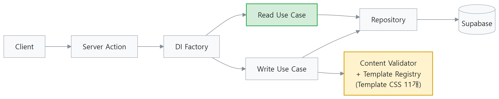
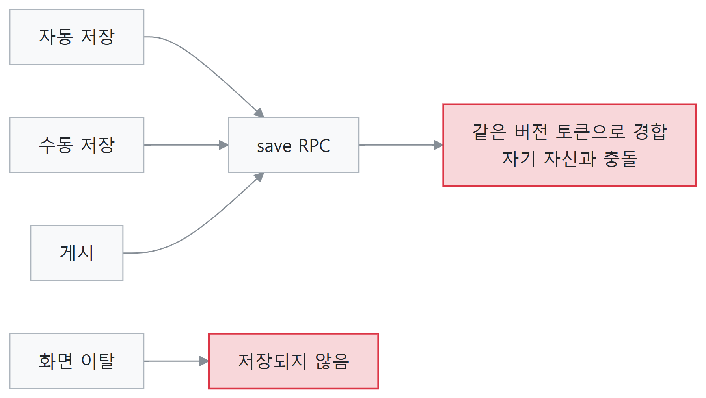
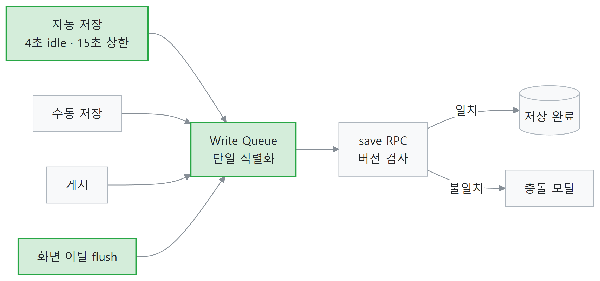
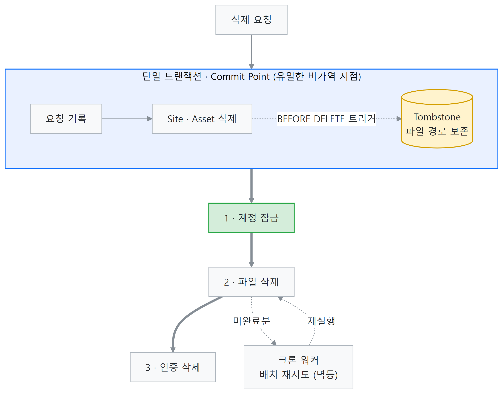

# Layer0 Studio

> **비개발자가 템플릿을 선택하고 시각적으로 편집하여 웹사이트를 배포하는 노코드 웹사이트 빌더**

**Next.js 16 · TypeScript · Supabase · Tailwind CSS v4 · Vercel**

| Templates | Tests | ADR | PR | Migrations |
| --- | --- | --- | --- | --- |
| 11 | 301 | 15 | 77 | 25 |

**🔗 Live** (https://layer0-studio.vercel.app) · **GitHub** (https://github.com/sungheeyoon/layer0-studio)

---

# 프로젝트 소개

사용자는 코드를 작성하지 않고 **템플릿 선택 → 시각적 편집 → 배포**의 세 단계로 자신의 웹사이트를 갖습니다. 현재 **9개 카테고리, 11개 Template**을 운영하고 있습니다.

### Template List

> 사용자는 템플릿을 선택하여 새로운 사이트를 생성합니다.

---

### Visual Editor

> 생성한 사이트를 시각적으로 편집하며 변경 사항을 즉시 확인할 수 있습니다.

---

### Template Pipeline

Template 디렉터리를 **Source of Truth(SSOT)** 로 설계하여 **디렉터리 추가부터 카탈로그 등록까지 하나의 파이프라인**으로 동작하도록 구현했습니다. 신규 Template은 디렉터리만 추가하면 Editor나 Registry를 수정하지 않고 등록됩니다.

> **디렉터리 추가만으로 등록되고, 검증을 통과한 Template만 카탈로그에 반영됩니다.**

---

# 아키텍처

Clean Architecture 기반으로 **의존성이 항상 안쪽으로만 흐르도록** 설계했습니다.

### 설계 포인트

- 요청마다 **DI Factory**가 Use Case를 조립하여 인증 컨텍스트 누설을 방지
- Domain Layer와 순수 함수 계층을 **In-memory Fake** 기반으로 테스트하여 DB 없이 **301개(도메인 109개)를 3.2초에 실행**
- **읽기 경로(Read)** 는 Template Registry에 의존하지 않도록 분리 (개선 ③의 기반)

---

# ⭐ 핵심 설계 개선

# ① 데이터가 사라지지 않는 편집기

> 편집 손실은 하나의 동시성 버그가 아니라 **경로의 집합**이었습니다. 손실 경로를 전수 열거하고 각각에 맞는 방어를 적용했습니다.

## Problem

기존 설계는 편집 손실을 **탭 간 동시 쓰기** 문제로만 모델링하고 있었습니다. 그 방어는 지금도 유효하지만, 같은 데이터가 사라지는 경로는 그 밖에도 열려 있었고 각각 메커니즘이 전혀 달랐습니다.

| 손실 경로 | 메커니즘 | 방어 |
| --- | --- | --- |
| 화면 이탈 | 에디터의 뒤로가기가 SPA 이동이라 이탈 이벤트가 발화하지 않음 | 언마운트 시 저장 flush |
| 무한 디바운스 | 자동 저장에 최대 대기 상한이 없어, 손을 멈추지 않고 입력하면 저장이 **한 번도** 실행되지 않음 | 최대 대기 **15초** 상한 |
| 검증 함정문 | 소비처가 없는 설정값이 blocking 검증에 걸려 사이트 전체 저장을 영구 차단 | Blocking → Warning 강등 |
| 탭 내 자기 충돌 | 자동 저장과 수동 저장이 같은 버전 토큰으로 경합 | 단일 Write Queue 직렬화 |

**가장 자연스럽게 누르는 버튼이 곧 조용한 손실 경로였습니다.** 에디터 상단의 뒤로가기 버튼은 SPA 이동이라 이탈 경고도 저장도 실행되지 않았습니다.

세 번째가 가장 심각했습니다. **어떤 렌더러도 읽지 않는** 레이아웃 설정 하나가 blocking 검증 대상이었고, 드롭다운이 제공하는 3개 값 중 2개가 검증을 통과하지 못했습니다. 사용자가 비어 보이는 컨트롤을 채우려고 클릭하면 2/3 확률로 그 사이트의 **모든 저장이 영구 실패**했고, 되돌릴 UI 경로도 없었습니다.

## Solution

- 손실 경로별 저장 전략 적용
- 화면 이탈 시 저장 강제 실행
- 자동 저장 최대 대기 시간을 **15초**로 제한
- 저장 요청을 **단일 Queue**로 직렬화
- 사용자 입력 중 발생하는 검증 오류를 **Blocking → Warning**으로 변경

## Result

| 항목 | Before | After |
| --- | --- | --- |
| 미저장 손실 시간 | 무제한 | 최대 15초 |
| 단독 편집 중 충돌 오류 | 발생 | 제거 |
| 값 하나로 인한 전체 저장 차단 | 발생 | 해소 |

### 개선 전

### 개선 후

### 설계 메모

- **저장을 막을 자격을 정의했습니다.** blocking은 *렌더러가 깨지거나 데이터 무결성이 무너지는 것*, warning은 *결과가 보기 싫을 뿐인 것*. 기존 blocking 규칙 20개를 "사용자가 UI로 도달 가능한가"로 분류하면 4개가 나왔고, 그 4개가 전부 후자였습니다.
- **탭 닫기·새로고침은 의도적으로 범위 밖입니다.** 별도 전송 API로 막을 수는 있지만 인증 레이어를 우회하는 새 저장 경로가 생깁니다. 경고 + 15초 상한으로 손실 창을 **유한한 값으로 고정**하는 쪽을 택했습니다.
- **배포 순서를 ADR로 고정했습니다.** 검증 완화를 먼저 배포한 뒤 저장 상한을 적용해야 새로운 저장 실패가 발생하지 않습니다.
- **로컬 초안 저장소는 도입하지 않았습니다.** 서버 저장 보장으로 문제를 해결하고, 로컬과 서버 간 동기화라는 또 다른 복잡성을 만들지 않았습니다.
- 검증 함수는 **순수 함수(Pure Function)** 로 구현하여 서버와 클라이언트가 동일한 규칙을 공유하도록 설계했습니다.

---

# ② 재개 가능한 계정 삭제 파이프라인

> 하나의 트랜잭션으로 처리할 수 없는 삭제 작업을 **재개 가능한 파이프라인**으로 재설계했습니다.

## Problem

- DB · Storage · Auth를 하나의 트랜잭션으로 처리할 수 없음
- 실제 운영 환경에서 부분 삭제(계정만 남는 상태) 발생
- 이미지 레코드 삭제 후 파일 경로를 복원할 수 없음

## Solution

- 삭제 요청과 데이터 삭제를 하나의 **Commit Point**로 통합
- **Tombstone** 테이블에 파일 경로를 보존
- 이후 작업을 계정 잠금 → 파일 삭제 → Auth 삭제 순으로 분리
- 실패한 작업은 Worker가 이어받아 재시도

## Result

| 항목 | Before | After |
| --- | --- | --- |
| 중간 단계 실패 | 부분 파괴 | 재개 후 완료 |
| 삭제 대상 파일 경로 | 레코드와 함께 소실 | 트리거로 보존 → 재시도 가능 |
| 계정 접근 차단 | 마지막 단계 | Commit 직후 |

### 설계 메모

- 기존 정리 큐는 삭제 대상과 함께 제거되어 재시도가 불가능했기 때문에 재사용하지 않았습니다.
- 파일 경로 기록을 **DB Trigger**로 강제한 뒤 연쇄 삭제를 추가하여 동일한 문제가 DB 레벨에서 재발하지 않도록 했습니다.
- Commit 이후 실패는 호출자에게 오류로 반환하지 않습니다. 이미 성공한 삭제를 실패로 알리는 것이 더 잘못된 정보라고 판단했습니다.

---

# ③ 초기 로딩 병목 제거

> 랜딩 페이지가 왜 Template CSS를 로드하는지 **의존성 그래프를 역추적**하여 원인을 제거했습니다.

## Problem

랜딩 페이지는 Template을 렌더링하지 않는데도 11개 Template의 CSS를 모두 로드하고 있었습니다. 역추적 결과 **인증 세션 조회 경로가 DI 모듈을 통해 Template Registry까지 연결**되어 있었고, Registry가 전체 Template 모듈을 끌어오면서 CSS가 초기 번들에 포함되고 있었습니다.

여기에 폰트 문제가 겹쳤습니다. Pretendard 전체를 preload 하고 있었고, Template별 외부 폰트까지 중복 요청되어 초기 폰트 전송량이 **4.29 MiB**에 달했습니다.

## Solution

- Read / Write DI 의존성 분리 → Template Registry를 Write 경로로 격리
- Pretendard를 **Unicode Range 기반 Dynamic Subset**으로 변경
- 초기 자산 회귀 검증 스크립트를 CI에 추가하여 재발 차단

## Result

| 항목 | Before | After |
| --- | --- | --- |
| 초기 CSS | 11개 | 1개 |
| 초기 폰트 | 4.29 MiB | 233 KiB |
| Lighthouse (Mobile) | 55 | 90 |
| FCP | 13.3s | 2.3s |
| LCP | 25.8s | 3.3s |

*프로덕션 URL · Lighthouse 모바일 · 3회 중앙값*

### 설계 메모

- 의존성 분리는 성능 수치를 위한 것이 아니라 **아키텍처 결정**이었습니다. 읽기 경로가 Template Registry를 참조하지 않는다는 규칙을 세운 결과로 초기 자산이 줄었습니다.
- 회귀 검증을 스크립트로 만들어 CI에 넣었습니다. 한 번 고치고 끝나는 문제가 아니라, 누군가 읽기 경로에서 Registry를 다시 import 하면 **빌드가 실패**합니다.
